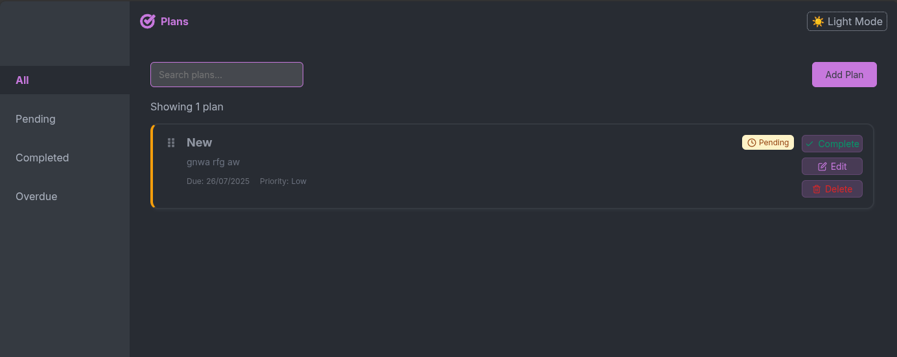

# 📋 Plans - Modern Task Management

> A sleek, accessible, and feature-rich todo application built with React, TypeScript, and Vite. Manage your tasks with style using modern drag-and-drop functionality, real-time filtering, and beautiful modal dialogs.




## 📑 Table of Contents

- [✨ Features](#-features)
- [🛠️ Tech Stack](#️-tech-stack)
- [🚀 Getting Started](#-getting-started)
  - [Prerequisites](#prerequisites)
  - [Installation](#installation)
  - [Development](#development)
- [📱 Usage](#-usage)
- [🎨 Styling](#-styling)
- [♿ Accessibility](#-accessibility)
- [🏗️ Project Structure](#️-project-structure)
- [🚀 Deployment](#-deployment)
  - [Build for Production](#build-for-production)
  - [Deploy to Vercel](#deploy-to-vercel)
  - [Deploy to Netlify](#deploy-to-netlify)
- [🔧 Configuration](#-configuration)
- [📖 API Reference](#-api-reference)
- [🤝 Contributing](#-contributing)
- [👨‍💻 Author](#-author)

## ✨ Features

### Core Functionality
- ✅ **Create, Read, Update, Delete** tasks with full CRUD operations
- 🎯 **Priority Management** - Set task priorities (Low, Medium, High)
- 📅 **Due Date Tracking** - Never miss a deadline
- ✔️ **Status Management** - Track pending and completed tasks
- 🔍 **Smart Filtering** - Filter by status, overdue items, or view all
- 🔎 **Real-time Search** - Find tasks instantly by title or description

### User Experience
- 🖱️ **Drag & Drop Reordering** - Intuitive task organization
- ⚡ **Real-time Loading States** - Visual feedback for all operations
- 💾 **Persistent Storage** - Tasks saved automatically in localStorage
- 📱 **Responsive Design** - Works perfectly on all devices
- 🎨 **Modern UI** - Clean, professional interface with smooth animations

### Accessibility
- ♿ **WCAG Compliant** - Full keyboard navigation support
- 🎤 **Screen Reader Friendly** - Proper ARIA labels and announcements
- ⌨️ **Keyboard Shortcuts** - Tab navigation and escape key support
- 🔍 **Focus Management** - Logical focus flow and visual indicators
- 📢 **Live Regions** - Real-time status updates for assistive technologies

## 🛠️ Tech Stack

### Frontend
- **React 18** - Modern React with hooks and concurrent features
- **TypeScript** - Type-safe development with excellent IntelliSense
- **Vite** - Lightning-fast build tool and development server

### Styling
- **CSS Modules** - Scoped styling with zero naming conflicts
- **Modern CSS** - Flexbox, Grid, Custom Properties, and Animations
- **Responsive Design** - Mobile-first approach with breakpoints

### State Management
- **Custom Hooks** - Clean separation of logic with `usePlans` hook
- **React State** - Efficient local state management
- **LocalStorage Integration** - Persistent data without external dependencies

### Development Tools
- **ESLint** - Code quality and consistency
- **Prettier** - Automatic code formatting
- **TypeScript Strict Mode** - Maximum type safety

## 🚀 Getting Started

### Prerequisites

Before you begin, ensure you have the following installed:
- **Node.js** (version 18.0 or higher)
- **npm** (version 8.0 or higher) or **yarn** (version 1.22 or higher)

### Installation

1. **Clone the repository**
   ```bash
   git clone git@github.com:PraisesPJMT/Plans.git
   cd Plans
   ```

2. **Install dependencies**
   ```bash
   npm install
   # or
   yarn install
   ```

3. **Start the development server**
   ```bash
   npm run dev
   # or
   yarn dev
   ```

4. **Open your browser**
   
   Navigate to `http://localhost:5173` to see the application running.

### Development

#### Available Scripts

| Command | Description |
|---------|-------------|
| `npm run dev` | Start development server with hot reload |
| `npm run build` | Build the app for production |
| `npm run preview` | Preview the production build locally |
| `npm run lint` | Run ESLint to check code quality |
| `npm run type-check` | Run TypeScript type checking |

#### Development Workflow

1. **Start the dev server**: `npm run dev`
2. **Make your changes** - The app will hot reload automatically
3. **Check types**: `npm run type-check`
4. **Lint your code**: `npm run lint`
5. **Build for production**: `npm run build`

## 📱 Usage

### Creating Tasks
1. Click the **"Add Plan"** button
2. Fill in the task details:
   - **Title** (required) - Brief description of the task
   - **Description** (required) - Detailed task information
   - **Due Date** (required) - When the task should be completed
   - **Priority** - Low, Medium, or High priority level
3. Click **"Add Plan"** to save

### Managing Tasks
- **Edit**: Click the edit button on any task to modify its details
- **Mark Complete**: Use the status dropdown in edit mode
- **Reorder**: Drag and drop tasks to reorganize them
- **Delete**: Use the delete functionality (implement as needed)

### Filtering & Search
- **Search**: Type in the search bar to find tasks by title or description
- **Filter by Status**: Show all, pending, completed, or overdue tasks
- **Sort**: Tasks maintain the order you set with drag and drop

## 🎨 Styling

The application uses **CSS Modules** for styling, providing:

### Key Style Features
- **Scoped Styles** - No CSS conflicts between components
- **Modern Design** - Clean, professional interface
- **Dark/Light Mode Ready** - CSS custom properties for theming
- **Smooth Animations** - Subtle transitions and micro-interactions
- **Responsive Layout** - Mobile-first design approach

### Customization
Modify styles in the respective `.module.css` files:
- `Dialog.module.css` - Modal dialog styling
- `App.module.css` - Main application layout
- Add your own modules for custom components

## ♿ Accessibility

Plans is built with accessibility as a first-class citizen:

### Features
- **Keyboard Navigation** - Full app functionality without a mouse
- **Screen Reader Support** - Comprehensive ARIA labels and descriptions
- **Focus Management** - Logical tab order and visible focus indicators
- **Error Handling** - Clear error messages with proper announcements
- **Color Contrast** - WCAG AA compliant color combinations
- **Semantic HTML** - Proper heading structure and landmark regions

## 🚀 Deployment

### Build for Production

Create an optimized production build:

```bash
npm run build
```

This generates a `dist` folder with optimized, minified files ready for deployment.

### Deploy to Netlify

1. **Build the project**
   ```bash
   npm run build
   ```

2. **Deploy via Netlify CLI**
   ```bash
   npm install -g netlify-cli
   netlify deploy --prod --dir=dist
   ```

3. **Or drag and drop** the `dist` folder to [Netlify Drop](https://app.netlify.com/drop)

## 📖 API Reference

### Custom Hook: `usePlans`

The main state management hook for the application.

```typescript
const {
  plans,              // All plans
  filteredPlans,      // Filtered plans based on search and filter
  searchTerm,         // Current search term
  filter,             // Current filter setting
  loading,            // Loading states for different operations
  addPlan,            // Function to add a new plan
  editPlan,           // Function to edit an existing plan
  deletePlan,         // Function to delete a plan
  togglePlanStatus,   // Function to toggle completion status
  setSearchTerm,      // Function to update search term
  setFilter,          // Function to update filter
  // Drag and drop handlers
  handleDragStart,
  handleDragOver,
  handleDrop,
  movePlan
} = usePlans();
```

### Types

```typescript
interface Plan {
  id: string;
  title: string;
  description: string;
  status: 'pending' | 'completed';
  dueDate: string;
  createdAt: string;
  priority: 'low' | 'medium' | 'high';
}

type FilterType = 'all' | 'pending' | 'completed' | 'overdue';
```


## 👨‍💻 Author

**Your Name**
- GitHub: [@PraisesPJMT](https://github.com/PraisesPJMT)
- Email: dev.praises@gmail.com
- LinkedIn: [Praises Tula](https://www.linkedin.com/in/praises-tula)
- Portfolio: [Praises Tula](https://https://praisestula.com.ng/)

---

<div align="center">
  <p>Built with ❤️ using React, TypeScript, and Vite</p>
  <p>
    <a href="#-table-of-contents">Back to Top</a>
  </p>
</div>